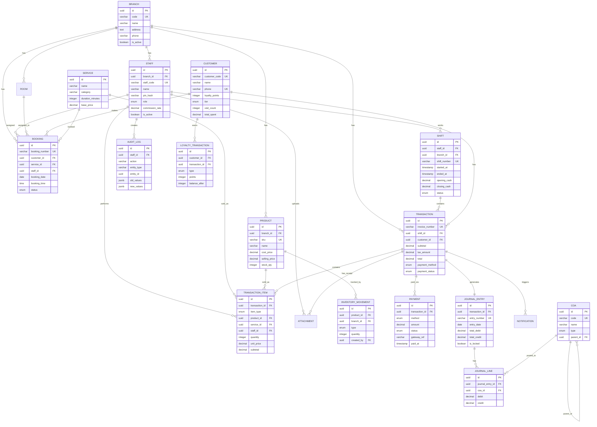

# 🗄️ Entity Relationship Diagram (ERD)
## Beauty & Shine — POS-ERP Integration Engine V6

---

| Field | Value |
|---|---|
| **Project** | Beauty & Shine — Radiance & Refinement |
| **Document** | ERD v1.0 |
| **Author** | System Analyst |
| **Date** | 2026-05-27 |
| **Database** | PostgreSQL 16 |
| **Status** | DRAFT — Pending Stakeholder Approval |

---

## 1. Entity Overview

```
┌─────────────────────────────────────────────────────────────────────┐
│                        BEAUTY & SHINE ERD                          │
│                     POS-ERP Integration Engine V6                   │
└─────────────────────────────────────────────────────────────────────┘

┌──────────────┐       ┌──────────────┐       ┌──────────────┐
│   BRANCH     │──────<│    STAFF     │──────<│    SHIFT     │
│              │       │              │       │              │
│ PK: id       │       │ PK: id       │       │ PK: id       │
│ name         │       │ FK: branch_id│       │ FK: staff_id │
│ address      │       │ name         │       │ started_at   │
│ phone        │       │ pin_hash     │       │ ended_at     │
│ is_active    │       │ role         │       │ status       │
└──────────────┘       └──────────────┘       └──────────────┘
       │                       │
       │                       │
       ▼                       ▼
┌──────────────┐       ┌──────────────┐       ┌──────────────┐
│   PRODUCT    │       │   SERVICE    │       │   BOOKING    │
│              │       │              │       │              │
│ PK: id       │       │ PK: id       │       │ PK: id       │
│ FK: branch_id│       │ name         │       │ FK: customer │
│ name         │       │ duration_min │       │ FK: service  │
│ sku          │       │ base_price   │       │ FK: staff_id │
│ price        │       │ category     │       │ datetime     │
│ stock_qty    │       │ is_active    │       │ status       │
└──────────────┘       └──────────────┘       └──────────────┘
       │                       │                       │
       └───────────┬───────────┘                       │
                   ▼                                   ▼
          ┌──────────────┐                    ┌──────────────┐
          │ TRANSACTION  │                    │   CUSTOMER   │
          │              │                    │              │
          │ PK: id       │                    │ PK: id       │
          │ FK: shift_id │                    │ name         │
          │ FK: customer │                    │ phone        │
          │ invoice_no   │                    │ email        │
          │ subtotal     │                    │ loyalty_pts  │
          │ tax_amount   │                    │ tier         │
          │ total        │                    │ visit_count  │
          │ payment_type │                    └──────────────┘
          │ status       │
          └──────┬───────┘
                 │
       ┌─────────┼─────────┐
       ▼         ▼         ▼
┌────────────┐ ┌────────────┐ ┌────────────┐
│  TXN_ITEM  │ │  PAYMENT   │ │ JOURNAL    │
│            │ │            │ │ _ENTRY     │
│ PK: id     │ │ PK: id     │ │            │
│ FK: txn_id │ │ FK: txn_id │ │ PK: id     │
│ item_type  │ │ method     │ │ FK: txn_id │
│ FK: product│ │ amount     │ │ FK: coa_id │
│ FK: service│ │ status     │ │ debit      │
│ qty        │ │ ref_number │ │ credit     │
│ unit_price │ │ paid_at    │ │ entry_date │
│ subtotal   │ └────────────┘ └────────────┘
└────────────┘
```

---

## 2. Detailed Entity Definitions

### 2.1 BRANCH
> Cabang/lokasi Beauty & Shine

| Column | Type | Constraint | Description |
|---|---|---|---|
| `id` | UUID | PK | Primary key |
| `code` | VARCHAR(20) | UNIQUE, NOT NULL | Kode cabang (e.g., "HQ", "BDG-01") |
| `name` | VARCHAR(100) | NOT NULL | Nama cabang |
| `address` | TEXT | | Alamat lengkap |
| `phone` | VARCHAR(20) | | Telepon cabang |
| `email` | VARCHAR(100) | | Email cabang |
| `timezone` | VARCHAR(50) | DEFAULT 'Asia/Jakarta' | Timezone |
| `is_active` | BOOLEAN | DEFAULT true | Status aktif |
| `created_at` | TIMESTAMP | DEFAULT NOW() | Dibuat |
| `updated_at` | TIMESTAMP | DEFAULT NOW() | Diupdate |

**Indexes:** `code` (unique), `is_active`

---

### 2.2 STAFF
> Pegawai/therapist/kasir

| Column | Type | Constraint | Description |
|---|---|---|---|
| `id` | UUID | PK | Primary key |
| `branch_id` | UUID | FK → BRANCH | Cabang penempatan |
| `staff_code` | VARCHAR(20) | UNIQUE, NOT NULL | Kode staff (e.g., "KSR001") |
| `name` | VARCHAR(100) | NOT NULL | Nama lengkap |
| `pin_hash` | VARCHAR(255) | NOT NULL | Hash PIN (bcrypt) |
| `role` | ENUM | NOT NULL | super_admin, owner, manager, kasir, therapist |
| `phone` | VARCHAR(20) | | Telepon |
| `email` | VARCHAR(100) | | Email |
| `commission_rate` | DECIMAL(5,2) | DEFAULT 0 | Persen komisi |
| `is_active` | BOOLEAN | DEFAULT true | Status aktif |
| `created_at` | TIMESTAMP | DEFAULT NOW() | Dibuat |
| `updated_at` | TIMESTAMP | DEFAULT NOW() | Diupdate |

**Indexes:** `staff_code` (unique), `branch_id`, `role`, `is_active`

**Enum: staff_role**
```
super_admin | owner | manager | kasir | therapist
```

---

### 2.3 SHIFT
> Sesi kerja kasir

| Column | Type | Constraint | Description |
|---|---|---|---|
| `id` | UUID | PK | Primary key |
| `staff_id` | UUID | FK → STAFF | Kasir yang shift |
| `branch_id` | UUID | FK → BRANCH | Cabang |
| `shift_number` | VARCHAR(30) | UNIQUE, NOT NULL | Nomor shift |
| `started_at` | TIMESTAMP | NOT NULL | Mulai shift |
| `ended_at` | TIMESTAMP | | Akhir shift |
| `opening_cash` | DECIMAL(15,2) | DEFAULT 0 | Kas awal |
| `closing_cash` | DECIMAL(15,2) | | Kas akhir (saat tutup) |
| `total_sales` | DECIMAL(15,2) | DEFAULT 0 | Total penjualan |
| `total_transactions` | INTEGER | DEFAULT 0 | Jumlah transaksi |
| `status` | ENUM | DEFAULT 'active' | active, closed |
| `created_at` | TIMESTAMP | DEFAULT NOW() | Dibuat |

**Indexes:** `staff_id`, `branch_id`, `status`, `started_at`

**Enum: shift_status**
```
active | closed
```

---

### 2.4 CUSTOMER
> Pelanggan

| Column | Type | Constraint | Description |
|---|---|---|---|
| `id` | UUID | PK | Primary key |
| `customer_code` | VARCHAR(20) | UNIQUE, NOT NULL | Kode customer |
| `name` | VARCHAR(100) | NOT NULL | Nama lengkap |
| `phone` | VARCHAR(20) | UNIQUE | Telepon (login identifier) |
| `email` | VARCHAR(100) | | Email |
| `birth_date` | DATE | | Tanggal lahir |
| `gender` | ENUM | | male, female |
| `loyalty_points` | INTEGER | DEFAULT 0 | Poin loyalty |
| `tier` | ENUM | DEFAULT 'bronze' | bronze, silver, gold, platinum |
| `visit_count` | INTEGER | DEFAULT 0 | Jumlah kunjungan |
| `total_spent` | DECIMAL(15,2) | DEFAULT 0 | Total belanja |
| `last_visit_at` | TIMESTAMP | | Kunjungan terakhir |
| `notes` | TEXT | | Catatan/preferensi |
| `is_active` | BOOLEAN | DEFAULT true | Status aktif |
| `created_at` | TIMESTAMP | DEFAULT NOW() | Dibuat |
| `updated_at` | TIMESTAMP | DEFAULT NOW() | Diupdate |

**Indexes:** `customer_code` (unique), `phone` (unique), `tier`, `is_active`

**Enum: customer_tier**
```
bronze | silver | gold | platinum
```

**Enum: gender**
```
male | female
```

---

### 2.5 PRODUCT
> Produk fisik (skincare, tools, dll)

| Column | Type | Constraint | Description |
|---|---|---|---|
| `id` | UUID | PK | Primary key |
| `branch_id` | UUID | FK → BRANCH | Cabang |
| `sku` | VARCHAR(30) | UNIQUE, NOT NULL | SKU |
| `name` | VARCHAR(150) | NOT NULL | Nama produk |
| `description` | TEXT | | Deskripsi |
| `category` | VARCHAR(50) | | Kategori |
| `cost_price` | DECIMAL(15,2) | NOT NULL | Harga modal |
| `selling_price` | DECIMAL(15,2) | NOT NULL | Harga jual |
| `stock_qty` | INTEGER | DEFAULT 0 | Stok saat ini |
| `min_stock` | INTEGER | DEFAULT 0 | Minimum stok (alert) |
| `unit` | VARCHAR(20) | DEFAULT 'pcs' | Satuan |
| `is_active` | BOOLEAN | DEFAULT true | Status aktif |
| `created_at` | TIMESTAMP | DEFAULT NOW() | Dibuat |
| `updated_at` | TIMESTAMP | DEFAULT NOW() | Diupdate |

**Indexes:** `sku` (unique), `branch_id`, `category`, `is_active`

---

### 2.6 SERVICE
> Layanan treatment

| Column | Type | Constraint | Description |
|---|---|---|---|
| `id` | UUID | PK | Primary key |
| `name` | VARCHAR(150) | NOT NULL | Nama layanan |
| `description` | TEXT | | Deskripsi |
| `category` | VARCHAR(50) | | Kategori (facial, hair, nail, body, lash) |
| `duration_minutes` | INTEGER | NOT NULL | Durasi (menit) |
| `base_price` | DECIMAL(15,2) | NOT NULL | Harga dasar |
| `commission_rate` | DECIMAL(5,2) | DEFAULT 0 | Komisi staff (%) |
| `is_active` | BOOLEAN | DEFAULT true | Status aktif |
| `created_at` | TIMESTAMP | DEFAULT NOW() | Dibuat |
| `updated_at` | TIMESTAMP | DEFAULT NOW() | Diupdate |

**Indexes:** `category`, `is_active`

---

### 2.7 BOOKING
> Janji temu / reservasi

| Column | Type | Constraint | Description |
|---|---|---|---|
| `id` | UUID | PK | Primary key |
| `booking_number` | VARCHAR(30) | UNIQUE, NOT NULL | Nomor booking |
| `customer_id` | UUID | FK → CUSTOMER | Pelanggan |
| `service_id` | UUID | FK → SERVICE | Layanan |
| `staff_id` | UUID | FK → STAFF | Staff yang ditugaskan |
| `branch_id` | UUID | FK → BRANCH | Cabang |
| `booking_date` | DATE | NOT NULL | Tanggal |
| `booking_time` | TIME | NOT NULL | Jam |
| `end_time` | TIME | | Jam selesai |
| `status` | ENUM | DEFAULT 'pending' | pending, confirmed, in_progress, completed, cancelled, no_show |
| `room_id` | UUID | FK → ROOM (nullable) | Ruangan treatment |
| `created_by` | VARCHAR(20) | | 'customer', 'staff', 'walk-in' |
| `notes` | TEXT | | Catatan |
| `cancelled_reason` | TEXT | | Alasan batal |
| `created_at` | TIMESTAMP | DEFAULT NOW() | Dibuat |
| `updated_at` | TIMESTAMP | DEFAULT NOW() | Diupdate |

**Indexes:** `booking_number` (unique), `customer_id`, `staff_id`, `booking_date`, `status`

**Enum: booking_status**
```
pending | confirmed | in_progress | completed | cancelled | no_show
```

---

### 2.8 TRANSACTION
> Transaksi penjualan (header)

| Column | Type | Constraint | Description |
|---|---|---|---|
| `id` | UUID | PK | Primary key |
| `invoice_number` | VARCHAR(30) | UNIQUE, NOT NULL | Nomor invoice (INV-YYYYMMDD-XXXX) |
| `shift_id` | UUID | FK → SHIFT | Shift saat transaksi |
| `customer_id` | UUID | FK → CUSTOMER (nullable) | Pelanggan (opsional) |
| `branch_id` | UUID | FK → BRANCH | Cabang |
| `subtotal` | DECIMAL(15,2) | NOT NULL | Subtotal sebelum pajak |
| `discount_amount` | DECIMAL(15,2) | DEFAULT 0 | Diskon |
| `tax_rate` | DECIMAL(5,2) | DEFAULT 11.00 | Pajak (%) |
| `tax_amount` | DECIMAL(15,2) | NOT NULL | Jumlah pajak |
| `total` | DECIMAL(15,2) | NOT NULL | Total akhir |
| `payment_method` | ENUM | NOT NULL | cash, bca_va, qris, card, transfer |
| `payment_status` | ENUM | DEFAULT 'pending' | pending, paid, partial, refunded, failed |
| `payment_ref` | VARCHAR(100) | | Reference payment gateway |
| `amount_paid` | DECIMAL(15,2) | DEFAULT 0 | Jumlah dibayar |
| `change_amount` | DECIMAL(15,2) | DEFAULT 0 | Kembalian |
| `notes` | TEXT | | Catatan |
| `created_at` | TIMESTAMP | DEFAULT NOW() | Dibuat |
| `updated_at` | TIMESTAMP | DEFAULT NOW() | Diupdate |

**Indexes:** `invoice_number` (unique), `shift_id`, `customer_id`, `branch_id`, `payment_status`, `created_at`

**Enum: payment_method**
```
cash | bca_va | qris | card | transfer
```

**Enum: payment_status**
```
pending | paid | partial | refunded | failed
```

---

### 2.9 TRANSACTION_ITEM
> Detail item per transaksi

| Column | Type | Constraint | Description |
|---|---|---|---|
| `id` | UUID | PK | Primary key |
| `transaction_id` | UUID | FK → TRANSACTION | Transaksi |
| `item_type` | ENUM | NOT NULL | product, service |
| `product_id` | UUID | FK → PRODUCT (nullable) | Produk (jika product) |
| `service_id` | UUID | FK → SERVICE (nullable) | Layanan (jika service) |
| `staff_id` | UUID | FK → STAFF (nullable) | Staff pelaksana (jika service) |
| `item_name` | VARCHAR(150) | NOT NULL | Nama item (snapshot) |
| `quantity` | INTEGER | NOT NULL DEFAULT 1 | Jumlah |
| `unit_price` | DECIMAL(15,2) | NOT NULL | Harga satuan |
| `discount_amount` | DECIMAL(15,2) | DEFAULT 0 | Diskon item |
| `subtotal` | DECIMAL(15,2) | NOT NULL | Subtotal (qty × price - discount) |
| `created_at` | TIMESTAMP | DEFAULT NOW() | Dibuat |

**Indexes:** `transaction_id`, `product_id`, `service_id`, `staff_id`

**Enum: item_type**
```
product | service
```

---

### 2.10 PAYMENT
> Record pembayaran (bisa split)

| Column | Type | Constraint | Description |
|---|---|---|---|
| `id` | UUID | PK | Primary key |
| `transaction_id` | UUID | FK → TRANSACTION | Transaksi |
| `method` | ENUM | NOT NULL | cash, bca_va, qris, card, transfer |
| `amount` | DECIMAL(15,2) | NOT NULL | Jumlah bayar |
| `status` | ENUM | DEFAULT 'pending' | pending, success, failed, refunded |
| `gateway_ref` | VARCHAR(100) | | Reference dari payment gateway |
| `gateway_response` | JSONB | | Raw response dari gateway |
| `paid_at` | TIMESTAMP | | Waktu pembayaran berhasil |
| `created_at` | TIMESTAMP | DEFAULT NOW() | Dibuat |

**Indexes:** `transaction_id`, `status`, `gateway_ref`

---

### 2.11 JOURNAL_ENTRY
> Jurnal akuntansi (auto-generated dari transaksi)

| Column | Type | Constraint | Description |
|---|---|---|---|
| `id` | UUID | PK | Primary key |
| `transaction_id` | UUID | FK → TRANSACTION (nullable) | Transaksi terkait |
| `entry_number` | VARCHAR(30) | UNIQUE, NOT NULL | Nomor jurnal |
| `entry_date` | DATE | NOT NULL | Tanggal jurnal |
| `description` | TEXT | | Keterangan |
| `total_debit` | DECIMAL(15,2) | NOT NULL | Total debit |
| `total_credit` | DECIMAL(15,2) | NOT NULL | Total credit |
| `is_locked` | BOOLEAN | DEFAULT false | Period lock |
| `created_at` | TIMESTAMP | DEFAULT NOW() | Dibuat |

**Indexes:** `entry_number` (unique), `transaction_id`, `entry_date`, `is_locked`

---

### 2.12 JOURNAL_LINE
> Detail baris jurnal

| Column | Type | Constraint | Description |
|---|---|---|---|
| `id` | UUID | PK | Primary key |
| `journal_entry_id` | UUID | FK → JOURNAL_ENTRY | Jurnal header |
| `coa_id` | UUID | FK → COA | Chart of Accounts |
| `debit` | DECIMAL(15,2) | DEFAULT 0 | Debit |
| `credit` | DECIMAL(15,2) | DEFAULT 0 | Credit |
| `description` | TEXT | | Keterangan |

**Indexes:** `journal_entry_id`, `coa_id`

---

### 2.13 COA (Chart of Accounts)
> Bagan akun

| Column | Type | Constraint | Description |
|---|---|---|---|
| `id` | UUID | PK | Primary key |
| `code` | VARCHAR(20) | UNIQUE, NOT NULL | Kode akun |
| `name` | VARCHAR(100) | NOT NULL | Nama akun |
| `type` | ENUM | NOT NULL | asset, liability, equity, revenue, expense |
| `parent_id` | UUID | FK → COA (nullable) | Akun induk |
| `is_active` | BOOLEAN | DEFAULT true | Status aktif |
| `created_at` | TIMESTAMP | DEFAULT NOW() | Dibuat |

**Indexes:** `code` (unique), `type`, `parent_id`

**Enum: account_type**
```
asset | liability | equity | revenue | expense
```

---

### 2.14 INVENTORY_MOVEMENT
> Pergerakan stok

| Column | Type | Constraint | Description |
|---|---|---|---|
| `id` | UUID | PK | Primary key |
| `product_id` | UUID | FK → PRODUCT | Produk |
| `branch_id` | UUID | FK → BRANCH | Cabang |
| `type` | ENUM | NOT NULL | in, out, adjustment, transfer |
| `quantity` | INTEGER | NOT NULL | Jumlah (positif masuk, negatif keluar) |
| `reference_type` | VARCHAR(50) | | transaction, purchase, adjustment, transfer |
| `reference_id` | UUID | | ID referensi |
| `notes` | TEXT | | Catatan |
| `created_by` | UUID | FK → STAFF | Staff yang input |
| `created_at` | TIMESTAMP | DEFAULT NOW() | Dibuat |

**Indexes:** `product_id`, `branch_id`, `type`, `created_at`

**Enum: movement_type**
```
in | out | adjustment | transfer
```

---

### 2.15 LOYALTY_TRANSACTION
> Riwayat poin loyalty

| Column | Type | Constraint | Description |
|---|---|---|---|
| `id` | UUID | PK | Primary key |
| `customer_id` | UUID | FK → CUSTOMER | Pelanggan |
| `transaction_id` | UUID | FK → TRANSACTION (nullable) | Transaksi terkait |
| `type` | ENUM | NOT NULL | earn, redeem, expire, adjust |
| `points` | INTEGER | NOT NULL | Jumlah poin |
| `balance_after` | INTEGER | NOT NULL | Saldo setelah |
| `description` | TEXT | | Keterangan |
| `expired_at` | TIMESTAMP | | Kadaluarsa poin |
| `created_at` | TIMESTAMP | DEFAULT NOW() | Dibuat |

**Indexes:** `customer_id`, `type`, `created_at`, `expired_at`

**Enum: loyalty_type**
```
earn | redeem | expire | adjust
```

---

### 2.16 AUDIT_LOG
> Log audit untuk semua perubahan

| Column | Type | Constraint | Description |
|---|---|---|---|
| `id` | UUID | PK | Primary key |
| `staff_id` | UUID | FK → STAFF (nullable) | Staff yang melakukan |
| `action` | VARCHAR(50) | NOT NULL | create, update, delete, login, logout |
| `entity_type` | VARCHAR(50) | NOT NULL | Nama tabel/entity |
| `entity_id` | UUID | | ID record |
| `old_values` | JSONB | | Data sebelum |
| `new_values` | JSONB | | Data sesudah |
| `ip_address` | VARCHAR(45) | | IP address |
| `user_agent` | TEXT | | User agent |
| `created_at` | TIMESTAMP | DEFAULT NOW() | Dibuat |

**Indexes:** `staff_id`, `action`, `entity_type`, `entity_id`, `created_at`

---

### 2.17 SUPPLIER
> Supplier/vendor untuk produk

| Column | Type | Constraint | Description |
|---|---|---|---|
| `id` | UUID | PK | Primary key |
| `name` | VARCHAR(150) | NOT NULL | Nama supplier |
| `contact_person` | VARCHAR(100) | | Nama PIC |
| `phone` | VARCHAR(20) | | Telepon |
| `email` | VARCHAR(100) | | Email |
| `address` | TEXT | | Alamat |
| `bank_name` | VARCHAR(50) | | Nama bank |
| `bank_account` | VARCHAR(30) | | Nomor rekening |
| `payment_terms` | VARCHAR(50) | | Terms (e.g., NET30, COD) |
| `is_active` | BOOLEAN | DEFAULT true | Status aktif |
| `created_at` | TIMESTAMP | DEFAULT NOW() | Dibuat |
| `updated_at` | TIMESTAMP | DEFAULT NOW() | Diupdate |

**Indexes:** `name`, `is_active`

---

### 2.18 ROOM
> Ruangan treatment

| Column | Type | Constraint | Description |
|---|---|---|---|
| `id` | UUID | PK | Primary key |
| `branch_id` | UUID | FK → BRANCH | Cabang |
| `name` | VARCHAR(50) | NOT NULL | Nama ruangan (e.g., "Room 1", "VIP Suite") |
| `capacity` | INTEGER | DEFAULT 1 | Kapasitas (untuk couple room = 2) |
| `room_type` | ENUM | NOT NULL | standard, vip, couple |
| `status` | ENUM | DEFAULT 'available' | available, occupied, maintenance |
| `equipment` | TEXT | | Peralatan di ruangan |
| `is_active` | BOOLEAN | DEFAULT true | Status aktif |
| `created_at` | TIMESTAMP | DEFAULT NOW() | Dibuat |

**Indexes:** `branch_id`, `room_type`, `status`

**Enum: room_type**
```
standard | vip | couple
```

**Enum: room_status**
```
available | occupied | maintenance
```

**Note:** BOOKING perlu tambah `room_id` FK untuk room scheduling.

---

### 2.19 PROMO
> Diskon dan promo

| Column | Type | Constraint | Description |
|---|---|---|---|
| `id` | UUID | PK | Primary key |
| `code` | VARCHAR(30) | UNIQUE, NOT NULL | Kode promo (e.g., "GLOW20") |
| `name` | VARCHAR(100) | NOT NULL | Nama promo |
| `description` | TEXT | | Deskripsi |
| `discount_type` | ENUM | NOT NULL | percentage, fixed |
| `discount_value` | DECIMAL(15,2) | NOT NULL | Nilai diskon (%) atau Rp |
| `max_discount` | DECIMAL(15,2) | | Maksimal diskon (untuk percentage) |
| `min_purchase` | DECIMAL(15,2) | DEFAULT 0 | Minimum belanja |
| `applicable_to` | ENUM | DEFAULT 'all' | all, product, service |
| `usage_limit` | INTEGER | | Maksimal penggunaan total |
| `usage_count` | INTEGER | DEFAULT 0 | Jumlah sudah dipakai |
| `per_customer_limit` | INTEGER | DEFAULT 1 | Maks per customer |
| `valid_from` | TIMESTAMP | NOT NULL | Mulai berlaku |
| `valid_until` | TIMESTAMP | NOT NULL | Berakhir |
| `is_active` | BOOLEAN | DEFAULT true | Status aktif |
| `created_at` | TIMESTAMP | DEFAULT NOW() | Dibuat |
| `updated_at` | TIMESTAMP | DEFAULT NOW() | Diupdate |

**Indexes:** `code` (unique), `is_active`, `valid_from`, `valid_until`

**Enum: discount_type**
```
percentage | fixed
```

**Enum: applicable_to**
```
all | product | service
```

---

### 2.20 NOTIFICATION
> Notifikasi ke customer dan staff

| Column | Type | Constraint | Description |
|---|---|---|---|
| `id` | UUID | PK | Primary key |
| `recipient_type` | ENUM | NOT NULL | customer, staff |
| `recipient_id` | UUID | NOT NULL | ID penerima |
| `channel` | ENUM | NOT NULL | email, whatsapp, sms, push |
| `type` | ENUM | NOT NULL | booking_confirmation, booking_reminder, payment_receipt, promo, loyalty, system |
| `title` | VARCHAR(200) | NOT NULL | Judul notifikasi |
| `body` | TEXT | NOT NULL | Isi pesan |
| `reference_type` | VARCHAR(50) | | booking, transaction, promo |
| `reference_id` | UUID | | ID referensi |
| `status` | ENUM | DEFAULT 'pending' | pending, sent, delivered, failed |
| `sent_at` | TIMESTAMP | | Waktu terkirim |
| `read_at` | TIMESTAMP | | Waktu dibaca |
| `error_message` | TEXT | | Pesan error jika gagal |
| `retry_count` | INTEGER | DEFAULT 0 | Jumlah retry |
| `created_at` | TIMESTAMP | DEFAULT NOW() | Dibuat |

**Indexes:** `recipient_id`, `recipient_type`, `status`, `type`, `created_at`

**Enum: recipient_type**
```
customer | staff
```

**Enum: channel**
```
email | whatsapp | sms | push
```

**Enum: notification_type**
```
booking_confirmation | booking_reminder | payment_receipt | promo | loyalty | system
```

**Enum: notification_status**
```
pending | sent | delivered | failed
```

---

### 2.21 ATTACHMENT
> File attachments (receipt, foto, dokumen)

| Column | Type | Constraint | Description |
|---|---|---|---|
| `id` | UUID | PK | Primary key |
| `entity_type` | VARCHAR(50) | NOT NULL | transaction, booking, customer, product |
| `entity_id` | UUID | NOT NULL | ID entity terkait |
| `file_name` | VARCHAR(255) | NOT NULL | Nama file |
| `file_path` | VARCHAR(500) | NOT NULL | Path penyimpanan |
| `file_type` | VARCHAR(50) | NOT NULL | MIME type (image/png, application/pdf) |
| `file_size` | INTEGER | | Ukuran file (bytes) |
| `description` | TEXT | | Keterangan |
| `uploaded_by` | UUID | FK → STAFF | Staff yang upload |
| `created_at` | TIMESTAMP | DEFAULT NOW() | Dibuat |

**Indexes:** `entity_type`, `entity_id`, `file_type`

#### Receipt Workflow Entities
```
TRANSACTION (receipt generated)
    │
    ├──→ ATTACHMENT (receipt PDF stored)
    │    entity_type = "transaction"
    │    file_type = "application/pdf"
    │
    └──→ NOTIFICATION (WhatsApp sent)
         channel = "whatsapp"
         type = "payment_receipt"
         reference_type = "transaction"
```

---

## 3. Relationships

| # | Parent | Child | Relationship | FK Column | On Delete |
|---|---|---|---|---|---|
| 1 | BRANCH | STAFF | 1:N | `staff.branch_id` | RESTRICT |
| 2 | BRANCH | PRODUCT | 1:N | `product.branch_id` | RESTRICT |
| 3 | BRANCH | BOOKING | 1:N | `booking.branch_id` | RESTRICT |
| 4 | BRANCH | TRANSACTION | 1:N | `transaction.branch_id` | RESTRICT |
| 5 | STAFF | SHIFT | 1:N | `shift.staff_id` | RESTRICT |
| 6 | SHIFT | TRANSACTION | 1:N | `transaction.shift_id` | RESTRICT |
| 7 | CUSTOMER | BOOKING | 1:N | `booking.customer_id` | SET NULL |
| 8 | CUSTOMER | TRANSACTION | 1:N | `transaction.customer_id` | SET NULL |
| 9 | SERVICE | BOOKING | 1:N | `booking.service_id` | RESTRICT |
| 10 | SERVICE | TRANSACTION_ITEM | 1:N | `txn_item.service_id` | SET NULL |
| 11 | PRODUCT | TRANSACTION_ITEM | 1:N | `txn_item.product_id` | SET NULL |
| 12 | TRANSACTION | TRANSACTION_ITEM | 1:N | `txn_item.transaction_id` | CASCADE |
| 13 | TRANSACTION | PAYMENT | 1:N | `payment.transaction_id` | CASCADE |
| 14 | TRANSACTION | JOURNAL_ENTRY | 1:1 | `journal_entry.transaction_id` | SET NULL |
| 15 | JOURNAL_ENTRY | JOURNAL_LINE | 1:N | `journal_line.journal_entry_id` | CASCADE |
| 16 | COA | JOURNAL_LINE | 1:N | `journal_line.coa_id` | RESTRICT |
| 17 | COA | COA (self) | 1:N | `coa.parent_id` | SET NULL |
| 18 | PRODUCT | INVENTORY_MOVEMENT | 1:N | `inv_movement.product_id` | RESTRICT |
| 19 | CUSTOMER | LOYALTY_TRANSACTION | 1:N | `loyalty_txn.customer_id` | CASCADE |
| 20 | STAFF | AUDIT_LOG | 1:N | `audit_log.staff_id` | SET NULL |
| 21 | BRANCH | ROOM | 1:N | `room.branch_id` | RESTRICT |
| 22 | ROOM | BOOKING | 1:N | `booking.room_id` | SET NULL |
| 23 | STAFF | NOTIFICATION | 1:N | `notification.recipient_id` | SET NULL |
| 24 | CUSTOMER | NOTIFICATION | 1:N | `notification.recipient_id` | SET NULL |
| 25 | STAFF | ATTACHMENT | 1:N | `attachment.uploaded_by` | SET NULL |
| 26 | TRANSACTION | ATTACHMENT | 1:N | `attachment.entity_id` | CASCADE |
| 27 | TRANSACTION | NOTIFICATION | 1:N | `notification.reference_id` | SET NULL |

---

## 4. Visual ERD (Mermaid)



---

## 5. Default Seed Data

### 5.1 Branch
```sql
INSERT INTO branch (code, name, address, phone) VALUES
('HQ', 'Beauty & Shine HQ', 'Jl. Sudirman No. 123, Jakarta', '021-1234567');
```

### 5.2 COA (Chart of Accounts)
```sql
INSERT INTO coa (code, name, type) VALUES
('1000', 'Kas', 'asset'),
('1001', 'Kas di Tangan', 'asset'),
('1002', 'Bank BCA', 'asset'),
('1100', 'Piutang Usaha', 'asset'),
('1200', 'Persediaan Produk', 'asset'),
('1300', 'Peralatan', 'asset'),
('2000', 'Utang Usaha', 'liability'),
('2100', 'Utang Pajak (PPN)', 'liability'),
('3000', 'Modal', 'equity'),
('3100', 'Laba Ditahan', 'equity'),
('4000', 'Pendapatan Jasa', 'revenue'),
('4100', 'Pendapatan Produk', 'revenue'),
('4200', 'Pendapatan Lain', 'revenue'),
('5000', 'Beban Gaji', 'expense'),
('5100', 'Beban Sewa', 'expense'),
('5200', 'Beban Persediaan', 'expense'),
('5300', 'Beban Operasional', 'expense'),
('5400', 'Beban Diskon', 'expense'),
('5500', 'Beban Komisi Staff', 'expense');
```

### 5.3 Staff
```sql
-- PIN: 1234, 5678, 0000, 9999 (hashed with bcrypt)
INSERT INTO staff (branch_id, staff_code, name, pin_hash, role) VALUES
((SELECT id FROM branch WHERE code='HQ'), 'ADM001', 'Admin Utama', '<bcrypt_hash>', 'super_admin'),
((SELECT id FROM branch WHERE code='HQ'), 'MGR001', 'Manager Toko', '<bcrypt_hash>', 'manager'),
((SELECT id FROM branch WHERE code='HQ'), 'KSR001', 'Siti Nurhaliza', '<bcrypt_hash>', 'kasir'),
((SELECT id FROM branch WHERE code='HQ'), 'KSR002', 'Dewi Lestari', '<bcrypt_hash>', 'kasir');
```

### 5.4 Services
```sql
INSERT INTO service (name, category, duration_minutes, base_price) VALUES
('Facial Treatment', 'facial', 60, 150000),
('Creambath', 'hair', 45, 120000),
('Hair Spa', 'hair', 60, 130000),
('Manicure', 'nail', 45, 80000),
('Pedicure', 'nail', 45, 90000),
('Body Massage', 'body', 90, 200000),
('Waxing', 'body', 30, 100000),
('Lash Extension', 'lash', 90, 250000),
('Eyebrow Threading', 'lash', 15, 50000),
('Face Mask', 'facial', 30, 75000),
('Body Scrub', 'body', 45, 160000),
('Aromatherapy', 'body', 60, 180000);
```

---

*Document ini harus di-review dan di-approve oleh stakeholder sebelum development phase dimulai.*
